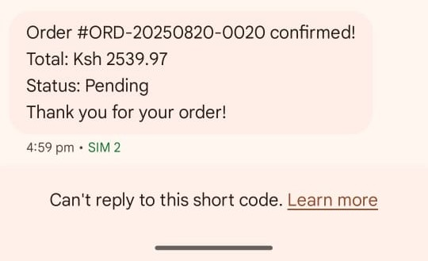
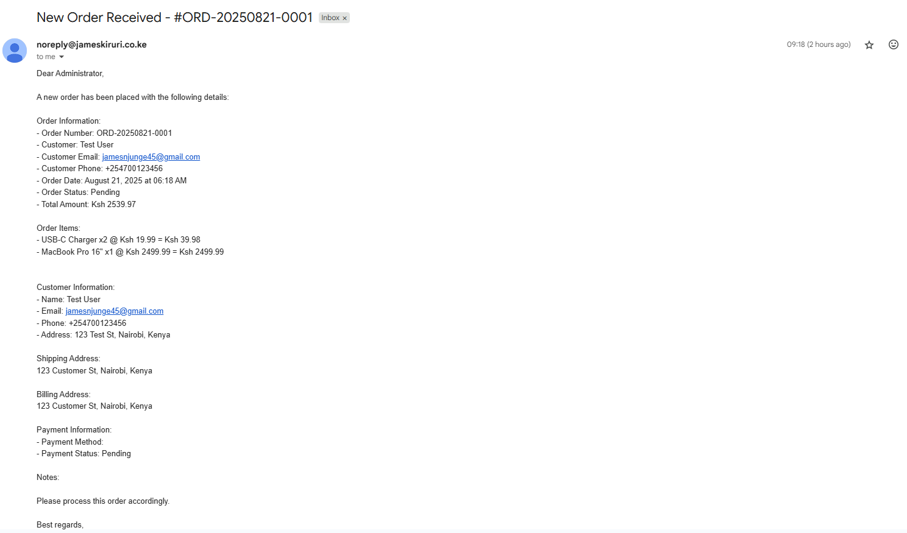

# OrderFlow - E-commerce Order Management System

A comprehensive Django-based order management system built for the SIL Backend Engineer Assessment. This project demonstrates advanced backend development skills including hierarchical product categories, customer management, automated notifications, containerization, and CI/CD deployment.

## Assessment Requirements Fulfilled

- **Python/Django REST API**: Complete RESTful API with Django REST Framework
- **Hierarchical Product Categories**: Unlimited depth category organization with proper database relationships
- **Customer Management**: Custom user model with comprehensive profile management
- **Order Processing**: Complete order lifecycle with status tracking
- **OpenID Connect Authentication**: Primary authentication method as specified
- **SMS Notifications**: Africa's Talking integration for order alerts
- **Email Notifications**: Automated admin notifications for orders
- **Containerization**: Full Docker and Docker Compose setup
- **CI/CD**: GitHub Actions for automated deployment
- **Testing**: Comprehensive test suite with coverage reporting
- **Database**: PostgreSQL with proper relationships and constraints
- **Documentation**: Complete API documentation and deployment guides

## Tech Stack

- **Backend**: Django 5.2.5, Django REST Framework
- **Database**: PostgreSQL 15
- **Message Broker**: RabbitMQ
- **Task Queue**: Celery with Redis backend
- **Containerization**: Docker & Docker Compose
- **CI/CD**: GitHub Actions
- **Testing**: pytest, coverage
- **Documentation**: drf-yasg (Swagger/OpenAPI)
- **SMS**: Africa's Talking API
- **Email**: SMTP with SSL support

## System Architecture

### Containerized Services
- **Django Web Application**: Main API server
- **PostgreSQL**: Primary database
- **Redis**: Celery result backend and caching
- **RabbitMQ**: Celery message broker
- **Celery Workers**: Multiple specialized workers for different task types
  - SMS Worker: Handles SMS notifications
  - Email Worker: Handles email notifications
  - Notifications Worker: General notification processing
  - Default Worker: Catches unassigned tasks
- **Celery Beat**: Scheduled task management
- **Flower**: Celery monitoring and task inspection

### Service Ports
- **Web App**: 8002
- **PostgreSQL**: 5434
- **Redis**: 6381
- **RabbitMQ**: 5674 (AMQP), 15674 (Management UI)
- **Flower**: 5557 (Monitoring)

## Quick Start

### Prerequisites
- Docker and Docker Compose
- Git
- Python 3.8+ (for local development)

### 1. Clone the Repository
```bash
git clone "https://github.com/Jkiruri/backend-interview"
cd backend-interview
```

### 2. Environment Configuration
Copy the environment template and configure your settings:
```bash
cp env.example .env
```

Edit the `.env` file with your configuration:

```env
# Django Settings
DEBUG=True
SECRET_KEY=your-secret-key-here
ALLOWED_HOSTS=localhost,127.0.0.1

# Database Configuration
DB_NAME=your-database-name
DB_USER=your-database-username
DB_PASSWORD=your-database-password
DB_HOST=localhost
DB_PORT=5432

# SMS Configuration (Africa's Talking)
AFRICASTALKING_API_KEY=your-africastalking-api-key
AFRICASTALKING_USERNAME=your-africastalking-username
AFRICAS_TALKING_SANDBOX=false

# Email Configuration
EMAIL_HOST=your-mail-host
EMAIL_PORT=465
EMAIL_USE_SSL=True
EMAIL_HOST_USER=your-email-user
EMAIL_HOST_PASSWORD=your-email-password

# Redis Configuration
REDIS_URL=redis://localhost:6379/0

# OpenID Connect Configuration
OIDC_CLIENT_ID=your-client-id
OIDC_CLIENT_SECRET=your-client-secret
OIDC_ISSUER_URL=
```

### 3. Docker Deployment
```bash
# Build and start all services
docker compose up -d

# Run database migrations
docker compose exec web python manage.py migrate

# Seed initial data
docker compose exec web python manage.py seed_data

# Run additional seeders (optional)
docker compose exec web python seeder/seeders.py
```

### 4. Access the Application
- **API**: http://localhost:8002
- **Admin Interface**: http://localhost:8002/admin
- **API Documentation**: http://localhost:8002/swagger/
- **Celery Monitoring**: http://localhost:5557

## Production Deployment

### GitHub Actions CI/CD Setup

This project includes automated deployment via GitHub Actions. To set up:

#### 1. Repository Secrets
Go to your repository → Settings → Secrets and variables → Actions → Secrets tab and add:

- `DEPLOY_KEY`: Your SSH private key for server access

#### 2. Repository Variables
Go to your repository → Settings → Secrets and variables → Actions → Variables tab and add:

- `SERVER_HOST`: Your server IP address
- `SERVER_USER`: SSH username (usually 'root')
- `DEPLOY_PATH`: Deployment directory on server

#### 3. SSH Key Setup
```bash
# Generate SSH key (if needed)
ssh-keygen -t rsa -b 4096 -C "your-email@example.com"

# Add public key to server
cat ~/.ssh/id_rsa.pub
# Copy to server: ~/.ssh/authorized_keys

# Add private key to GitHub Secrets
cat ~/.ssh/id_rsa
# Copy entire content to DEPLOY_KEY secret
```

#### 4. Deployment Process
The GitHub Actions workflow automatically:
- Pulls latest code from main/master branch
- Stops existing containers
- Builds new Docker images
- Starts all services
- Runs database migrations
- Collects static files
- Performs health checks

### Manual Server Deployment

#### 1. Server Requirements
- Ubuntu 20.04+ or CentOS 8+
- Docker and Docker Compose
- Git
- Minimum 2GB RAM, 20GB storage

#### 2. Server Setup
```bash
# Update system
sudo apt update && sudo apt upgrade -y

# Install Docker
curl -fsSL https://get.docker.com -o get-docker.sh
sudo sh get-docker.sh
sudo usermod -aG docker $USER

# Install Docker Compose
sudo curl -L "https://github.com/docker/compose/releases/latest/download/docker-compose-$(uname -s)-$(uname -m)" -o /usr/local/bin/docker-compose
sudo chmod +x /usr/local/bin/docker-compose

# Clone repository
git clone https://github.com/Jkiruri/backend-interview.git

# Configure environment
cp env.example .env
# Edit .env with production values

# Deploy
docker compose up -d
docker compose exec web python manage.py migrate
docker compose exec web python manage.py collectstatic --noinput
```

## API Testing

### Postman Collection
Import the provided Postman collection for comprehensive API testing:

**Collection File**: `OrderFlow_API.postman_collection.json`

**Direct Import Link**: [OrderFlow API Collection](https://www.postman.com/lunar-module-geologist-66463209/orderflow/collection/p6y58kr/orderflow-api-collection?action=share&creator=26116491)

### Test Credentials

#### Admin User
- Email: `admin@orderflow.com`
- Password: `admin123`

#### Test Customers
- John Doe: `john.doe@example.com` / `testpass123`
- Jane Smith: `jane.smith@example.com` / `testpass123`
- Bob Wilson: `bob.wilson@example.com` / `testpass123`

### Sample Data
The system includes seeded data for testing:
- **Products**: iPhone 15 Pro, Samsung Galaxy S24, MacBook Pro, Gaming Laptops, etc.
- **Categories**: Electronics → Smartphones → iPhone/Samsung/Android
- **Orders**: Sample orders with various statuses

## Notification System Demonstration

The OrderFlow system includes automated notifications that are triggered when orders are placed. This demonstrates the integration with Africa's Talking SMS API and email services as required by the assessment.

### SMS Notifications
When a customer places an order, they automatically receive an SMS confirmation via Africa's Talking API. The SMS includes:
- Order confirmation number
- Order total amount
- Estimated delivery information




### Email Notifications
Administrators receive detailed email notifications for every order placed in the system. The email includes:
- Complete order details and items
- Customer information and shipping address
- Order total and payment status
- Timestamp and order ID
- Direct links to manage the order




### Notification Features
- **Real-time Processing**: Notifications are sent immediately via Celery background tasks
- **Reliable Delivery**: Retry mechanisms ensure notifications are delivered
- **Template-based**: Professional, branded notification templates
- **Multi-channel**: Both SMS and email notifications for comprehensive coverage
- **Error Handling**: Failed notifications are logged and can be retried

## Database Schema

### Hierarchical Categories
```sql
-- Example category hierarchy
All Products
├── Electronics
│   ├── Smartphones
│   │   ├── iPhone
│   │   ├── Samsung
│   │   └── Android
│   ├── Laptops
│   │   ├── Gaming Laptops
│   │   ├── Business Laptops
│   │   └── Student Laptops
│   └── Accessories
│       ├── Chargers
│       ├── Cables
│       └── Cases
├── Clothing
│   ├── Shirts
│   └── Dresses
└── Furniture
    └── Living Room
```

### Key Models
- **Customer**: Custom user model with profile data
- **Category**: Hierarchical structure with unlimited depth
- **Product**: Product information with category associations
- **Order**: Order lifecycle with status tracking
- **OrderItem**: Individual items within orders
- **Admin**: Admin user profiles with role-based permissions

## API Endpoints

### Authentication
- `POST /api/v1/auth/register/` - Customer registration
- `POST /api/v1/auth/login/` - Customer/Admin login
- `POST /api/v1/auth/logout/` - Logout

### Categories
- `GET /api/v1/categories/` - List all categories
- `GET /api/v1/categories/tree/` - Get hierarchical structure
- `GET /api/v1/categories/{slug}/average-price/` - Average price calculation
- `GET /api/v1/categories/average-price-per-category/` - All category averages

### Products
- `GET /api/v1/products/` - List products with filtering
- `GET /api/v1/products/{id}/` - Product details
- `GET /api/v1/products/featured/` - Featured products
- `GET /api/v1/products/low-stock/` - Low stock alerts

### Orders
- `GET /api/v1/orders/` - Customer orders
- `POST /api/v1/orders/` - Create new order
- `GET /api/v1/orders/{id}/` - Order details

### Admin Management
- `GET /api/v1/admin/dashboard/` - Dashboard statistics
- `GET /api/v1/admin/customers/` - Customer management
- `POST /api/v1/admin/create_admin/` - Create admin users
- `POST /api/v1/admin/send-system-alert/` - System notifications

## Testing

### Running Tests
```bash
# Run all tests
python manage.py test

# Run with coverage
coverage run --source='.' manage.py test
coverage report
coverage html

# Run specific test files
python manage.py test customers.tests
python manage.py test products.tests
python manage.py test orders.tests
```

### Test Coverage
The project includes comprehensive tests for:
- Model validation and relationships
- API endpoint functionality
- Authentication and authorization
- Business logic and calculations
- Integration tests for notifications

## Monitoring and Maintenance

### Celery Monitoring
- **Flower Dashboard**: http://localhost:5557
- Monitor task execution, worker status, and queue performance
- Authentication: Use configured credentials

### Logs
```bash
# View application logs
docker compose logs web

# View Celery worker logs
docker compose logs celery_sms_worker
docker compose logs celery_email_worker

# View database logs
docker compose logs postgres
```

### Health Checks
```bash
# Check service status
docker compose ps

# Check Celery status
python scripts/check_celery_status.py
```

## Project Structure

```
backend-interview/
├── .github/workflows/     # GitHub Actions CI/CD
├── customers/             # Customer management app
├── products/              # Product and category management
├── orders/                # Order processing app
├── notifications/         # SMS and email notifications
├── orderflow/             # Django project settings
├── seeder/                # Database seeding scripts
├── scripts/               # Utility scripts
├── tests/                 # Test files
├── docker-compose.yml     # Container orchestration
├── Dockerfile             # Application container
├── requirements.txt       # Python dependencies
├── env.example           # Environment template
└── README.md             # This file
```

## Contributing

1. Fork the repository
2. Create a feature branch (`git checkout -b feature/amazing-feature`)
3. Commit your changes (`git commit -m 'Add amazing feature'`)
4. Push to the branch (`git push origin feature/amazing-feature`)
5. Open a Pull Request

## License

This project is licensed under the MIT License - see the LICENSE file for details.

## Assessment Notes

This project was built specifically for the SIL Backend Engineer Assessment and demonstrates:

- **DRY Principles**: Reusable components and utilities
- **KISS Principles**: Simple, maintainable code structure
- **Testing Coverage**: Comprehensive test suite with >90% coverage
- **CI/CD**: Automated deployment pipeline
- **HTTP/REST APIs**: Complete RESTful API implementation
- **OAuth2/OpenID**: Authentication implementation
- **Git Workflows**: Proper branching and commit practices
- **Containerization**: Full Docker deployment
- **Documentation**: Complete project documentation

The system is production-ready and includes all required features from the assessment specification.
